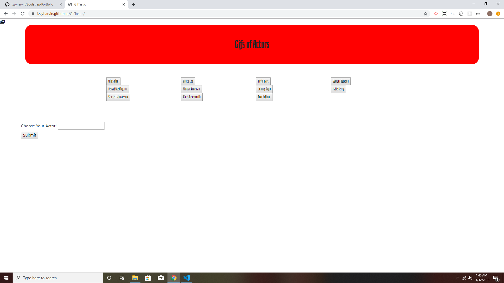
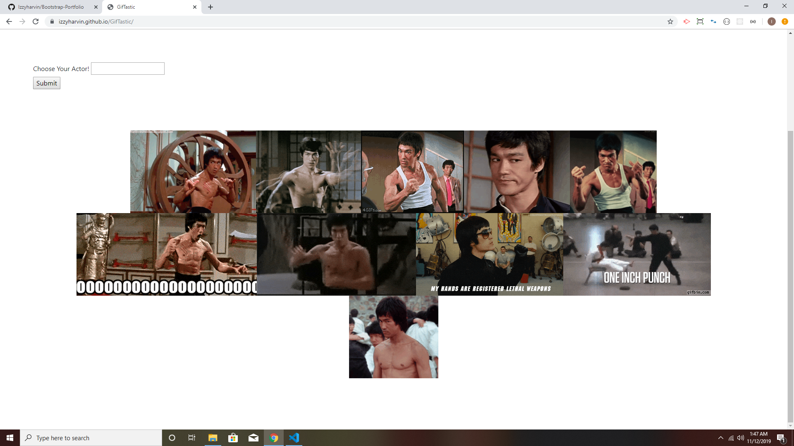
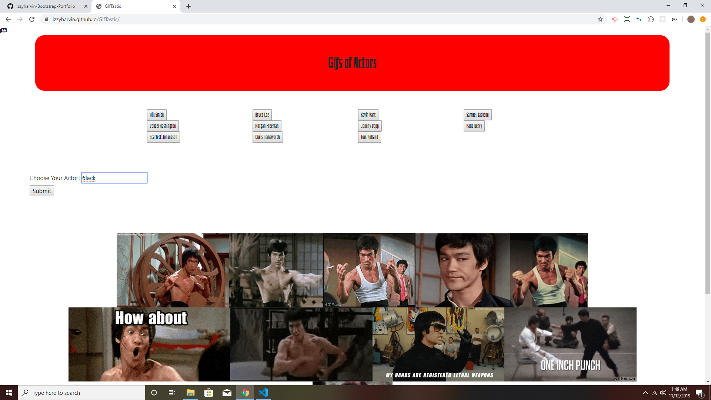
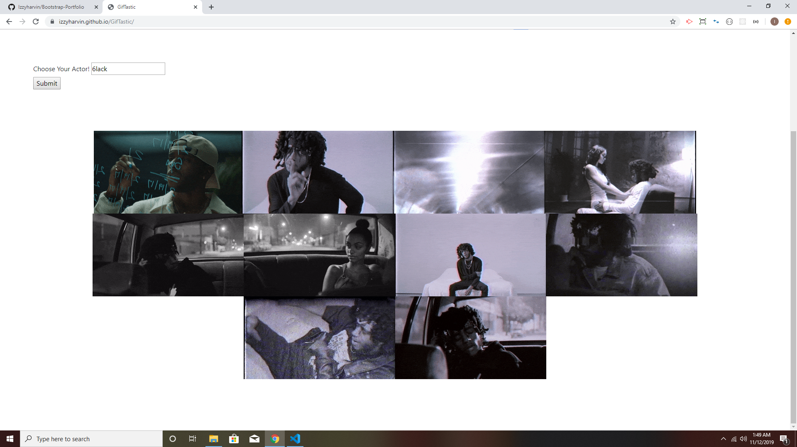

# GifTastic
Gif application that uses the GIPHY API to ask users choice of GIFs.

# Link for app

- https://izzyharvin.github.io/GifTastic/

# Language and API used:

- HTML5
- CSS
- JAVASCRIPT
- Giphy API
- Ajax

# How to use Giftastic

- First step is go to link and page will open up.

- Next, you can click on the button to look at different Gifs for that person.

- If you don't see what you like then you can create a button.

- If you press a letter that you already choose it will show an alert.

Creator of App
Israel Harvin